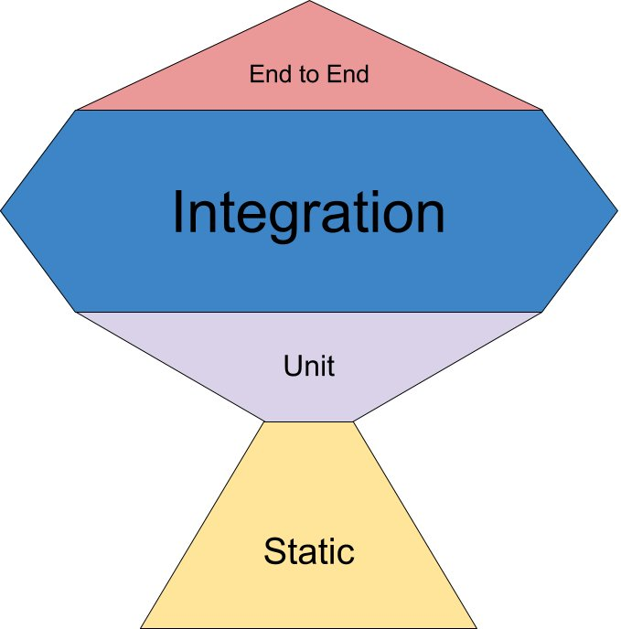

# ユニットテスト研修

新人〜ミドルエンジニア向けの xUnit / .NET 10 を使ったユニットテスト研修教材です。
xUnit はあくまで題材として採用しているツールであり、この教材で身につけてほしいのは特定のフレームワークの使い方ではなく、ユニットテストの考え方そのものです。
対象読者は「テストダブル(モック・スタブなど)が全く分からない」レベルを想定しています。
課題には「穴埋め形式」と「テストを1本まるごと自分で書く形式」の2つがあります(詳しくは後述の「進め方」)。

## 研修の構成と時間配分(2時間)

この研修のゴールは Level4(テストダブル)にたどり着くことです。 Level4 だけは全員が終わる前提で時間を組んでいます。そのため Level は「必修」と「付録」に分かれています。

| 区分 | Level | 内容 | 目安 |
|---|---|---|---|
| 必修 | Level 1 | かんたんな Assert | 10分 |
| 必修 | Level 2 | いろいろな Assert の種類(穴埋め) | 10分 |
| 必修 | Level 3 | Act した後の状態変化 | 15分 |
| 必修 | Level 3B | 時間に依存するコードのテスト | 15分 |
| 必修 | Level 4 | テストダブル(この研修の本題) | 45分 |
| 付録 | Level 5 | Controller のテスト | 時間外 |
| 付録 | Level 6 | 実行順序と並列化 | 時間外 |
| 付録 | Level 7 | WebApplicationFactory による結合テスト | 時間外 |
| 付録 | Level 8 | コードカバレッジ | 時間外 |

### タイムテーブル

| 時間 | 内容 |
|---|---|
| 0:00 - 0:10 | 導入(この研修のゴール / 3A パターンの説明) |
| 0:10 - 0:20 | Level 1 |
| 0:20 - 0:30 | Level 2 |
| 0:30 - 0:45 | Level 3 |
| 0:45 - 1:00 | Level 3B |
| 1:00 - 1:05 | 休憩 |
| 1:05 - 1:50 | Level 4 |
| 1:50 - 2:00 | まとめ(テストダブルとの付き合い方) |

### 進行のコツ

- Level1・2 は準備運動。詰まっている人がいなければ巻きで進めてよい
- Level3 の発展課題は任意。遅れているなら飛ばして先へ進む
- Level3B は飛ばさない。「テストのために依存を注入する」という体験が、Level4 の前提になっている
- Level4 は 45 分を死守する。とくに `StubExampleTests.cs` の3本目(通信エラーをスタブで再現する課題)までは必ず到達させる。ここがこの研修で一番持ち帰ってほしい部分
- 付録の Level5・6・7・8 は、研修時間内では扱わない。興味がある人の持ち帰り課題

### まとめで確認すること(Level4 の到達目標)

- テストダブルは 極力使わない(過剰なモックは、壊れやすいのにバグを見つけないテストになる)
- ただし 武器として持っておく。とくに次の2つ
  - 外部APIを実際に叩かないためにスタブへ差し替え、呼び出し側が通常どおり動くことを確かめ、外部APIは「正しい引数で呼ばれたことだけ」を確認する
  - 通信エラーのように「意図的に起こすのが難しい異常系」を、スタブで起こして確かめる
- 覚えるのは スタブ・モック・スパイの3つで十分(ダミー・フェイクは用語として知っていればよい)

## イントロダクション: テストフレームワークの系譜(xUnit系 / BDD系)

この教材で使う xUnit.net をはじめ、世の中のテストフレームワークは大きく xUnit系 と BDD系 の2つの潮流に分けられます。どちらも「テストコードを書いて検証する」こと自体は同じですが、設計思想と書き方(構文)が異なります。

### xUnit系

Kent Beck が Smalltalk 向けに作った SUnit を源流とし、「テストクラス」に「テストメソッド」を並べ、`Assert.Equal(expected, actual)` のようなプログラマ向けの検証を行うスタイルです。この教材の Level1〜7(3Bを含む)はすべてこの書き方です。

| フレームワーク | 言語 |
|---|---|
| xUnit.net | .NET (この教材で使用) |
| NUnit | .NET |
| JUnit | Java |
| PHPUnit | PHP |
| pytest | Python |

xUnit系の例(xUnit.net):

```csharp
public class CalculatorTests
{
    [Fact]
    public void Add_2と3を渡すと_5を返す()
    {
        var calculator = new Calculator();

        var actual = calculator.Add(2, 3);

        Assert.Equal(5, actual);
    }
}
```

### BDD系(Behavior-Driven Development)

「テスト」ではなく「仕様(Specification)」を書く、という発想のスタイルです。`describe` / `context` / `it` (あるいは Gherkin 記法の `Given` / `When` / `Then`) を使って、人が読んでも仕様として理解できる形でテストを書きます。

| フレームワーク | 言語 | 備考 |
|---|---|---|
| RSpec | Ruby | BDD系の源流にあたる代表的フレームワーク |
| JSSpec | JavaScript | RSpec に影響を受けた初期の JS BDD ツール。後述の Jasmine の前身にあたる |
| Jasmine | JavaScript | `describe`/`it` 構文の初期の代表例 |
| Mocha + Chai | JavaScript | Mocha(実行) + Chai(`expect(x).to.equal(y)` のようなBDD風アサーション) |
| Cucumber | 多言語対応 | Gherkin(`Given`/`When`/`Then`)でシナリオを書く、非エンジニアも読める形式 |
| JBehave | Java | Cucumber と同様 Gherkin ライクな記法で書ける、Java向けBDDフレームワークの草分け的存在 |
| SpecFlow / Reqnroll | .NET | .NET 版 Cucumber。Gherkin の feature ファイルを使う |

BDD系の例(RSpec):

```ruby
RSpec.describe Calculator do
  describe "#add" do
    context "2と3を渡したとき" do
      it "5を返す" do
        calculator = Calculator.new

        result = calculator.add(2, 3)

        expect(result).to eq(5)
      end
    end
  end
end
```

同じ「2と3を足すと5になる」という内容でも、xUnit系は「テストメソッド」として書くのに対し、RSpec は `describe`(対象) → `context`(状況) → `it`(期待する振る舞い) という入れ子構造で、文章のように読める「仕様」として書きます。

### まとめ

- どちらが優れているという話ではなく、チームの文化によって向き不向きがあります。
- この教材は .NET の標準的な選択肢である xUnit.net を使い、xUnit系の基本の書き方(3Aパターン)を身につけることを目的としています。

## 進め方

### 課題の2つの形式

Level によって、課題の形式が2段階に分かれています。

| 形式 | 対象 | やること |
|---|---|---|
| 穴埋め形式 | Level 2・3B・5・6・7 | `// 穴埋め: ...` コメントの箇所だけを書き換える。Assert の語彙と 3A(Arrange-Act-Assert)の型を覚える段階 |
| 記述形式 | Level 1・3・4 | `[Fact(Skip = "要件: ...")]` が付いたメソッドの Skip を外し、テストを自分で書く。Level1 は各ステップに「そこで何をするか」を書いた `// 穴埋め:` コメントがあるのでそれに沿って書き、Level3・5 は各ファイル先頭の完成済みの見本を読んでから1本まるごと書く(3A のコメントは書く場所の目印として置いてある) |

Level1 は最初の1本目なので各ステップの指示をコメントで細かく置き、Level3・Level4 は見本を1本置いたうえで記述形式にしています(Level2・3B・5・6・7 は穴埋め形式のままです)。

記述形式にしているのは、穴埋めだと答えが一意に決まってしまい、「次に何を検証すべきか」を考える余地がなくなるからです。検証したいことを自分で言葉にし、それをテストの形にするところまでが練習の対象です。各 Level の README にある発展課題は、テストメソッド名すら決まっていません。仕様を決めるところから始めてください。

### 手順

1. `tests/TrainingApp.Tests/` 配下の Level ごとの README を読む
2. その Level のテストファイルを開き、上記の形式にしたがって書く
3. `src/TrainingApp/` 配下のプロダクションコードは変更しないこと
4. `dotnet test` を実行し、テストが Green(成功) になれば完了

現在の状態では、多くのテストは意図的に 失敗する(赤) か、Skip(未着手) になっています。

`dotnet test` の結果に `skipped` が残っている間は、まだ書いていないテストがあるということです。記述形式の Level では、「失敗 0 件」ではなく「失敗 0 件かつ Skip 0 件」が完了条件だと考えてください。

ただし Level4 の `FakeExampleTests.cs` だけは読み物という位置づけの任意課題なので、ここの Skip は残っていて構いません。

```bash
dotnet test
```

### Docker で実行する場合

ローカルに .NET SDK をインストールしなくても、Docker があればテストを実行できます。

```bash
docker compose run --rm test
```

`src/` と `tests/` はコンテナにバインドマウントされるため、ホスト側のエディタでテストコードを編集し、そのままコンテナ内で `dotnet test` を実行できます。

特定の Level だけ実行したい場合は、コマンドを明示的に指定します(`Dockerfile` の `CMD` はデフォルトの `dotnet test` を隠蔽していないので、そのまま上書きできます)。

```bash
docker compose run --rm test dotnet test --filter "FullyQualifiedName~TrainingApp.Tests.Level1_SimpleAssert"
```

## ディレクトリ構成

```
src/TrainingApp/            対象となるプロダクションコード
  Services/                 CalculatorService, DiscountService, ShoppingCartService, GreetingService, OrderService, ...
  Controllers/               ProductsController
  External/                  外部API呼び出しを抽象化したインターフェースと本番実装
  Models/                    Product, Coupon, CartItem, OrderResult など

tests/TrainingApp.Tests/    研修課題(Level1・3・5: 記述形式 / Level2・3B・4・6・7: 穴埋め形式)
  Level1_SimpleAssert/       Level 1
  Level2_AssertTypes/        Level 2
  Level3_StateChange/        Level 3
  Level3B_TimeDependency/    Level 3B (時間に依存するコードのテスト)
  Level4_TestDoubles/        Level 4 (ダミー/スタブ/モック/スパイ/フェイク)
  Level5_ControllerSpec/     Level 5
  Level6_OrderingAndParallelization/  Level 6 (実行順序・並列化)
  Level7_IntegrationTesting/  Level 7 (WebApplicationFactoryによる結合テスト)
  Level8_CodeCoverage/       Level 8 (コードカバレッジのはかり方とベストプラクティス / READMEのみ)
  Infrastructure/            テスト順序制御・共有フィクスチャなどの補助コード

Dockerfile / docker-compose.yml   Docker でテストを実行するための構成
dotnet-tools.json                 Stryker.NET などのローカルツールのマニフェスト
```

## テストに関する前提知識: テストピラミッドとテストサイズ

演習に入る前に、「ユニットテスト」がテスト全体の中でどの位置づけにあるのかを整理しておきます。

### テストピラミッド / テストトロフィー

- テストピラミッド: 「実行が速く安価なユニットテストを土台に大量に持ち、実行が遅く高価な結合テスト・E2Eテストは少数に絞る」という古典的な考え方。下から ユニット → 結合 → E2E の順に積み上がる三角形で表される。
- テストトロフィー (Kent C. Dodds 氏が提唱): フロントエンド開発などモジュール間の結合が多い領域では、細かすぎるユニットテストよりも「結合テスト」に比重を置いたほうが費用対効果が高いという考え方。ユニット層を薄く、結合層を厚くしたトロフィー(優勝カップ)型の比率になる。

| テストピラミッド | テストトロフィー |
|---|---|
|  |  |
| [出典: Ham Vocke - The Practical Test Pyramid](https://martinfowler.com/articles/practical-test-pyramid.html) | [出典: Kent C. Dodds - Write tests. Not too many. Mostly integration.](https://kentcdodds.com/blog/write-tests) |

どちらが正しいという話ではなく、対象システムの特性によって最適なバランスは変わる、という点が重要です。この教材(Level1〜4)は、まず基本となるユニットテスト(テストピラミッドの土台)の書き方を身につけることを目的としています。

### 「単体テスト」「結合テスト」の定義はチームによって違う

たとえば「依存をモックに差し替えていればユニットテスト」と考えるチームもあれば、「実際のHTTPパイプラインやDIコンテナまで含めて検証しないと結合テストとは呼べない」と考えるチームもあり、「単体テスト」「結合テスト」という言葉の境界はチームや文脈によってかなり揺れます。(この教材では Level5 と Level7 で、実際にこの境界線上にある2つのテストの書き方を比較します)

日本語で著名なテストの実践者である t_wada(和田卓人)氏は、この曖昧さを踏まえて、Google のテスト文化などで使われる 「テストサイズ」 という尺度(Small / Medium / Large)を紹介しています。これは「単体/結合」という開発者の主観に依存しがちな分類の代わりに、「外部プロセス通信の有無」「ネットワーク越しの通信の有無」「実行時間」といった客観的な基準でテストを分類する考え方です。

- Small: 単一プロセス内で完結し、ネットワーク・ディスクI/O・外部プロセスに依存しない(この教材の Level1〜4 がこれに近い)
- Medium: 同一マシン内の別プロセス(ローカルDBなど)とは通信してよい
- Large: ネットワーク越しの外部サービスとの通信を含む、E2Eに近いテスト

チームで「単体テスト」という言葉を使うときは、まず「どのサイズのテストを指しているのか」を揃えておくと、認識のズレによる手戻りを防げます。

## 各レベルの内容

必修(Level1〜3B・4)は2時間の研修で扱う範囲、【付録】(Level5・6・7・8)は研修時間内では扱わない持ち帰り課題です。

### Level 1: かんたんな Assert(必修)
`CalculatorServiceTests.cs`

3A パターン(Arrange-Act-Assert)の基本の型を身につける。`Assert.Equal` と `Assert.Throws` を使う。

記述形式。各ステップに「そこで何をするか」を書いた `// 穴埋め:` コメントが置いてあるので、その下に中身を書く。1本目だけ Arrange のコードが入っており、2本目からは Arrange も自分で書く。書き方の見本は Level1 の README にあるサンプルコード。

### Level 2: いろいろな Assert の種類(必修)
`DiscountServiceTests.cs`

`Assert.True` / `Assert.False` / `Assert.Null` / `Assert.NotNull` / `Assert.Contains` など、場面に応じた Assert メソッドの使い分けを学ぶ。

### Level 3: Act した後の状態変化を確認する(必修)
`ShoppingCartServiceTests.cs`

戻り値だけでなく、Act の実行によってオブジェクトの「状態」がどう変わるかを検証する。

この Level から記述形式になり、見本を1本読んだあとは、テストを自分で書く。発展課題では「同じ商品を2回追加したらどうなるべきか」など、仕様を決めるところから始める。

### Level 3B: 時間に依存するコードのテスト(必修)
`GreetingServiceTests.cs`

`GreetingService` は「現在時刻」によって結果が変わるロジックを持っています。もし `DateTime.Now` を直接呼び出していたら、テストは実行するタイミングによって結果が変わってしまう不安定なテスト(flaky test)になります。

`GreetingService` はコンストラクタで `TimeProvider`(.NET 8 で追加された標準の時刻抽象化クラス)を受け取るように作られており、テスト側では `Microsoft.Extensions.TimeProvider.Testing` パッケージの `FakeTimeProvider` を使って時刻を固定(freeze)してから検証します。時刻を固定しない限りテストの前提が成立しないため、「なぜテストのために時刻を注入・固定できる設計にするのか」を体感できる内容になっています。

### Level 4: テストダブル(必修・この研修の本題)

すべて「外部の決済API」を模した `IPaymentGateway`(と関連する `IOrderNotifier` / `IReceiptPrinter`)を題材にしています。

記述形式。`DummyExampleTests.cs` は全体が見本なのでまず読み、残りは各ファイル先頭の見本を参考に自分で書きます。

この Level で持ち帰ってほしいのは「テストダブルは極力使わない。ただし武器として持っておく」という感覚です。 過剰なモックは、実装を変えるたびに壊れるのにバグは1件も見つけない、割に合わないテストになります。そのうえで、ダブルが無いと詰む場面が2つあります。

1. 外部APIを実際に叩かずに、呼び出し側のロジックを確かめたいとき(最頻出)。`OrderService.PlaceOrder()` をテストしたいだけなのに、本物の決済ゲートウェイを使えばテストのたびに本当に課金されてしまう。そこでスタブに差し替え、呼び出し側が通常どおり動くことを確かめ、外部APIについては「正しい引数で呼ばれたことだけ」を確認する。その先で何が起きるかは外部サービスの責任であって、こちらのテストの関心事ではない
2. 意図的に起こすのが難しい異常系を再現したいとき。通信エラーやタイムアウトを本物相手に毎回同じように起こすのはほぼ不可能で、結果として異常系だけテストが無いまま本番を迎えることになる。「起こせないからテストしない」ではなく「スタブで起こす」という選択肢を持っているかどうかが、そのまま品質の差になる。`StubExampleTests.cs` の3本目がこの課題

> C# に `SystemError` という型はありません。近いものに `System.SystemException`(`NullReferenceException` などの基底クラス)がありますが、Microsoft 自身が「継承するな・catch するな」と案内している .NET 1.0 時代の名残です。この教材では、実務で実際に飛んでくる `HttpRequestException`(通信失敗)を題材にしています。

覚えるのは スタブ・モック・スパイの3つで十分です。ダミーとフェイクは用語として知っていればよく、ファイルも読み物として置いてあります。

| 種類 | ファイル | 特徴 | 扱い |
|---|---|---|---|
| スタブ (Stub) | `StubExampleTests.cs` | あらかじめ決められた戻り値を返す(例外を投げる場合も含む)。呼ばれ方は検証しない | 必修・主力 |
| モック (Mock) | `MockExampleTests.cs` | 「呼ばれるはずだ」という期待を事前に設定し、事後に `Verify()` でテストダブル自身に評価させる | 必修 |
| スパイ (Spy) | `SpyExampleTests.cs` | 呼び出しの記録を自分で保持しておき、評価はテストコード側が `Assert` で行う(手書き実装) | 必修 |
| ダミー (Dummy) | `DummyExampleTests.cs` | 引数として必要だが、テスト対象のロジックの中では一切使われないオブジェクト | 読み物 |
| フェイク (Fake) | `FakeExampleTests.cs` | 簡易的だが実際に動くロジックを持つ、ミニチュア版の本物 | 読み物 |

使うかどうかの判断は「本物 → フェイク → スタブ → モック」の順に検討し、無理なときだけ下に降ります。とくにモック/スパイは、決済やメール送信のように自分たちが所有していないプロセス境界に限るのが目安です。

#### モックとスパイの違い(参考: [xUnit Test Patterns - Mock Object](http://xunitpatterns.com/Mock%20Object.html))

モックとスパイの本質的な違いは「間接出力の評価をどこで行うか」です。

- モック: テストダブル自身が評価する(Self Verifying)。Moq では `Verify()` を呼ぶことで、評価をモックオブジェクトに委ねる
- スパイ: テストダブルは記録するだけで、評価はテストコード側が行う。`SpyExampleTests.cs` では手書きの `SpyOrderNotifier` に記録させ、通常の `Assert` で検証している

`MockExampleTests.cs` と `SpyExampleTests.cs` を見比べて、この違いを確認してください。

#### なぜ外部APIをユニットテストに含めないのか

`src/TrainingApp/External/` には `PaymentGateway`(HTTP経由で本物の決済APIを呼ぶ)などの本番実装がありますが、これらはユニットテストの対象に含めていません。理由は主に2つです。

1. フレーキーなテストになるため
   ネットワークやサードパーティのサービスの状態に依存するテストは、コードが正しくても、ネットワーク遅延・サービス障害・レート制限などによって失敗することがあります(いわゆる flaky test)。これが混ざると「テストが落ちた」ときにコードのバグなのか環境の問題なのか切り分けが難しくなり、テストスイート全体の信頼性が下がります。

2. 責任分離ができていないため
   ユニットテストは「そのクラス/メソッド自身のロジックが正しいか」を検証するものです。外部APIの実装まで含めてテストしてしまうと、「自分のコードのバグ」と「外部サービス側の問題」が同じテストの中に混在してしまい、テストの目的(何を保証したいか)が曖昧になります。

外部サービスとの結合部分は、ユニットテストではなく 結合テスト(Integration Test) や E2Eテスト で別途検証するべきものです。ユニットテストでは、`IPaymentGateway` のようなインターフェースを介してテストダブルに差し替えることで、「自分のコード(OrderService)のロジックだけ」を高速かつ安定して検証します。

### Level 5: Controller のテスト(Controller Spec)【付録】
`ProductsControllerTests.cs`

ASP.NET Core の Controller をテストし、`OkObjectResult` / `NotFoundResult` / `CreatedAtActionResult` などの `ActionResult` を検証する。依存関係(リポジトリ)は Moq でモック化する。

> 依存をすべてモックに差し替えて Controller クラス単体を直接 `new` しているため、この教材では「ユニットテスト」に分類しています。ただし、チームによってはこれを「結合テスト」と呼ぶ場合もあります(詳しくは前述の「単体テスト・結合テストの定義はチームによって違う」を参照)。

参考: [Microsoft Learn - コントローラーのテスト](https://learn.microsoft.com/ja-jp/aspnet/core/mvc/controllers/testing?view=aspnetcore-10.0) に、Controller をユニットテストする際の考え方が詳しくまとまっています。

### Level 6: テストの実行順序と並列化【付録】

#### 6-A: カスタム属性による実行順序の指定
`OrderedExecutionTests.cs` / `Infrastructure/TestPriorityAttribute.cs` / `Infrastructure/PriorityOrderer.cs`

xUnit は本来「テストの実行順序に依存しない」ことを前提にしていますが、シナリオテストなど順序に意味があるケースのために、`ITestCaseOrderer` を自作して `[TestPriority]` 属性の値でテストを並び替える方法を学ぶ。

#### 6-B: テストの並列化とコレクション
`ParallelCollectionExampleTests.cs` / `Infrastructure/SharedCounterFixture.cs`

xUnit はデフォルトで異なるテストクラスを並列実行します。共有状態を持つテストクラス同士を `[Collection("...")]` で同じコレクションにまとめることで、並列実行を防ぎ、安全に状態を共有する方法を学ぶ。
アセンブリ全体の並列度は `tests/TrainingApp.Tests/xunit.runner.json` で設定している。

### Level 7: DIコンテナと WebApplicationFactory を使った結合テスト【付録】
`ProductsApiFactory.cs` / `ProductsEndpointTests.cs`

Level5 では `ProductsController` を直接 `new` してテストしました(コンストラクタにモックを手動で注入)。Level7 ではさらに一歩進み、`WebApplicationFactory<Program>` を使ってアプリを実際に起動し、実際の HTTP エンドポイント(`GET`/`POST`)にリクエストを送って検証します。

- ルーティング・モデルバインディング・JSONシリアライズまで含めて動作を確認できる、より「本物」に近いテストです
- `Program.cs` に登録済みの本物の `IProductRepository` 実装を、DIコンテナのレベルでモックに差し替えます(`services.RemoveAll<IProductRepository>()` → `services.AddSingleton(mock.Object)`)
- `ProductsApiFactory` は xUnit の Fixture(`IClassFixture<T>` で共有されるセットアップ用オブジェクト)です。Level6 の `SharedCounterFixture` は完成品を「使う」だけでしたが、Level7 では `ConfigureWebHost` の中身を自分で実装することで、Fixture を「作る」体験もできます

> このテストは Level5 よりも実行が遅く、依存の差し替えもDIコンテナ経由と手間が増えます。前述の「テストサイズ」で言えば Level5 が Small に近いのに対し、Level7 は実際のHTTPスタックを起動する分 Medium に近づきます。「速くて安価なテストを土台に、遅くて本物に近いテストを少数だけ持つ」というテストピラミッドの考え方を、Level5 と Level7 の対比で体感できます。

### Level 8: コードカバレッジのはかり方とベストプラクティス【付録】
`Level8_CodeCoverage/README.md`

Level1〜7 で書いたテストが、プロダクションコードのどこを実行できているかを コードカバレッジ で計測します。穴埋め課題ではなく、実際に計測してレポートを読み、テストが薄い場所を自分で見つける Level です。

- `dotnet test --collect:"XPlat Code Coverage"`(既存の `coverlet.collector` を利用)でカバレッジを取得し、ReportGenerator で HTML レポートに変換して読む
- line coverage / branch coverage の違いを確認し、「line は高いが branch が低い」クラスの未通過分岐をテストで埋める
- カバレッジとの付き合い方(目標値にしない / 80〜90%が現実的な上限で100%は疑わしい / ゲートにするなら絶対値より差分)を整理する

> カバレッジは「コードが実行されたか」しか示さず、「正しく検証されたか」は測れません。付録のミューテーションテスト(深さ)と Level8 のカバレッジ(広さ)はセットで見る、という位置づけです。

## 使用技術

- .NET 10 / ASP.NET Core Web API
- xUnit 2.5
- Moq 4.20 (モック/スタブの作成)
- Microsoft.Extensions.TimeProvider.Testing (時刻のフェイク)
- Microsoft.AspNetCore.Mvc.Testing (WebApplicationFactoryによる結合テスト)
- coverlet.collector 6.0 (コードカバレッジの計測)
- ReportGenerator 5.5 (カバレッジのHTMLレポート生成 / Level8。`dotnet-tools.json` にローカルツールとして登録)
- Stryker.NET 4.16 (ミューテーションテスト)
- Docker / Docker Compose (任意)

## 付録: ミューテーションテストによるテストの質の検証

Level1〜7 では「テストを書くこと」自体を学びましたが、書いたテストが本当にバグを検知できるのか?は別の問題です。たとえば `Assert.NotNull(actual)` だけでは、`actual` の中身が間違っていてもテストは気づけません。

ミューテーションテストは、プロダクションコードにわざと小さなバグ(ミュータント)を注入し、既存のテストがそのバグを検知して落ちるかどうかを機械的にチェックする手法です。テストが検知できたミュータントの割合を「ミューテーションスコア」と呼び、これが Level8 のコードカバレッジよりも「テストの実効性」に近い指標になります(カバレッジ=そのコードが実行されたか、ミューテーションスコア=その振る舞いが検証されているか)。

これまでの Level1〜7 とは違い、穴埋めをすればクリアという単純な課題ではなく、自分の書いたテストの弱点を自分で見つけて補強するという、テストに対する一段深い視点が必要になります。研修の中でも一番難易度が高い内容のため、付録という位置づけにしています。

この教材では [Stryker.NET](https://stryker-mutator.io/docs/stryker-net/introduction/) を dotnet ローカルツールとして導入しています。

```bash
# 初回のみ: ツールをインストール
dotnet tool restore

# Level1〜6(3Bを含む)をすべて解いて全テストが Green の状態で実行する
cd tests/TrainingApp.Tests
dotnet stryker
```

Docker で実行する場合は、イメージのビルド時に `dotnet tool restore` 済みなので、そのまま `dotnet stryker` を実行できます。

```bash
docker compose run --rm test dotnet stryker
```

対象は `stryker-config.json` で `CalculatorService` / `DiscountService` / `ShoppingCartService` に絞っています(実行時間を抑えるため)。実行後、生存した(検知できなかった)ミュータントがあれば、それを殺せるように Level1〜3 で書いた Assert を見直すのが課題です。

> 注意: ミューテーションテストは実行に時間がかかります(対象クラスやテスト数に応じて数分〜)。まずは Level1〜6 をすべて Green にしてから実行してください。テストが1つでも失敗した状態では Stryker は実行できません(初期テスト実行の失敗率が高いと解析を中断する仕組みになっています)。
